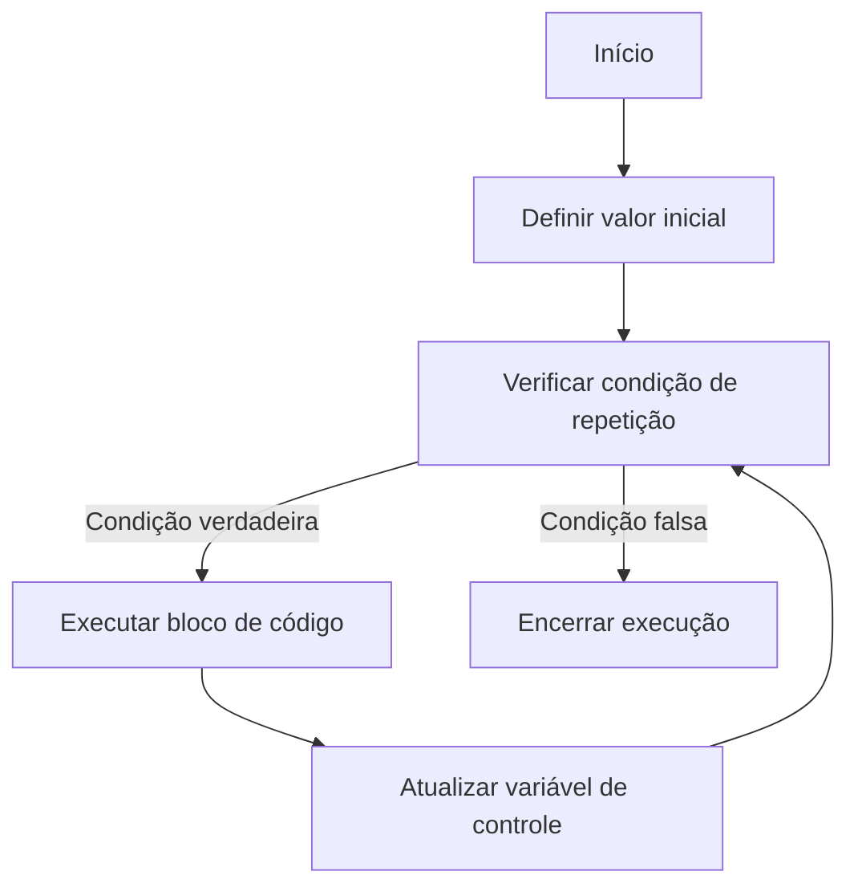
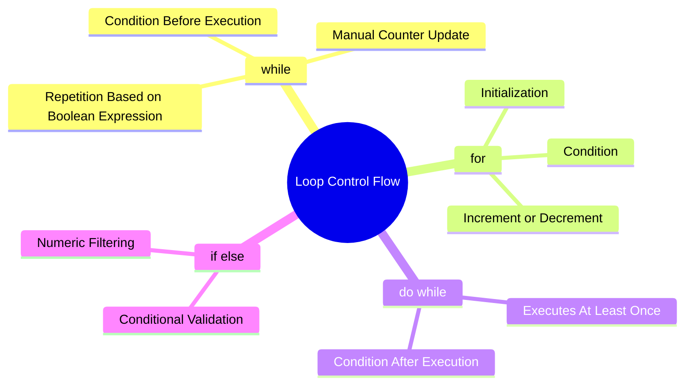
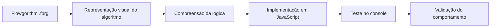
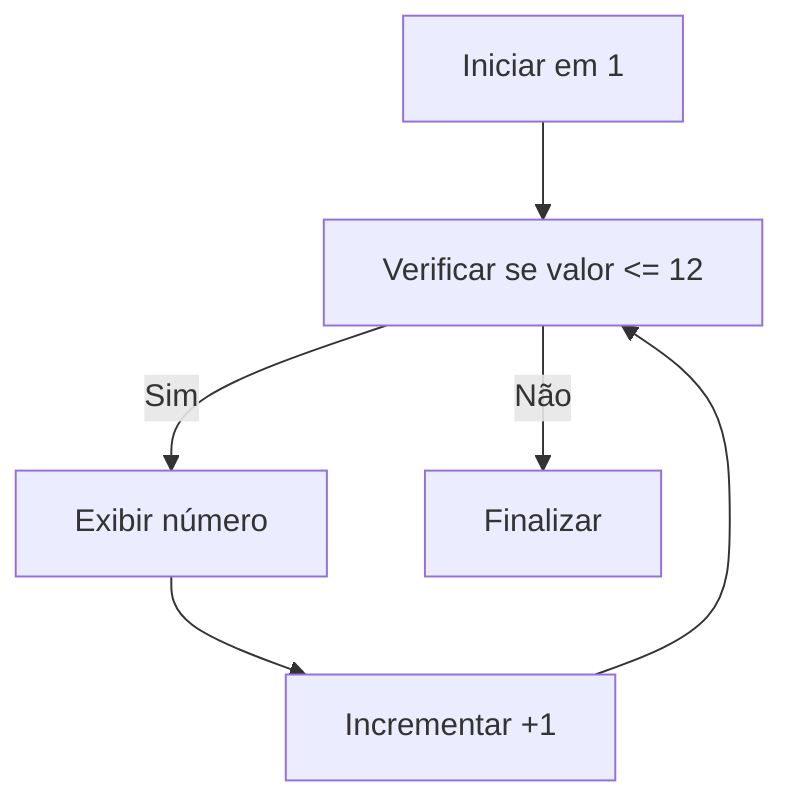
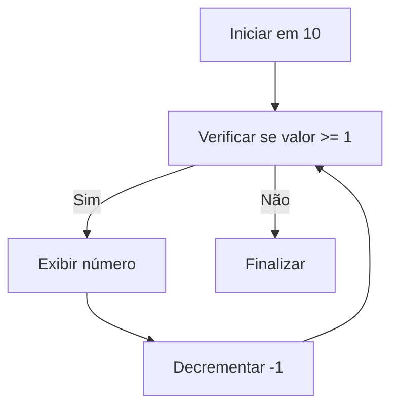
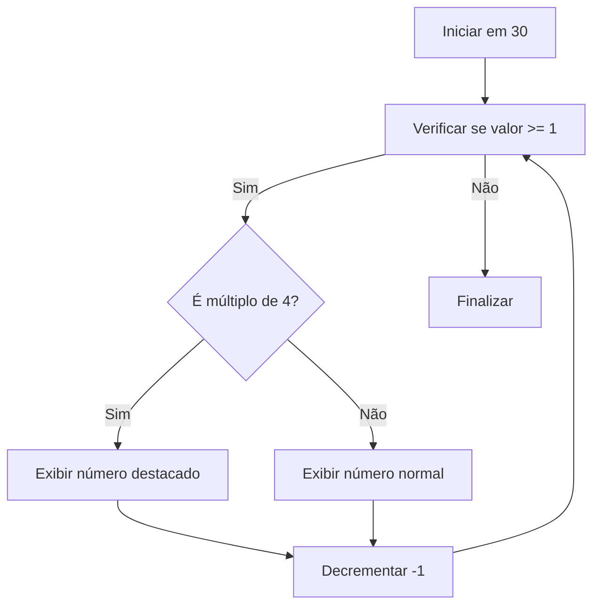

# JavaScript Loop Control Flow Algorithms

<p align="center">
  
  
  
  
</p>

## Overview

Repositório com exercícios de lógica de programação desenvolvidos em JavaScript e Flowgorithm, com foco na prática de estruturas de repetição, controle de fluxo e resolução de problemas sequenciais.

O projeto explora diferentes formas de repetição, utilizando `while`, `for` e `do...while` para implementar contagens progressivas, contagens regressivas, múltiplos numéricos, entrada de dados e validações condicionais.

## Technical Scope

| Área | Aplicação |
|---|---|
| Linguagem principal | JavaScript |
| Ferramenta complementar | Flowgorithm |
| Paradigma | Programação imperativa |
| Entrada de dados | `prompt()` |
| Saída de dados | `console.log()` |
| Estruturas principais | `while`, `for`, `do...while`, `if/else` |
| Foco técnico | Laços de repetição e controle de fluxo |

## Repository Structure

```text
javascript-loop-control-flow-algorithms/
├── Code/
│   ├── ex1.js
│   ├── ex2.js
│   ├── ex3.js
│   ├── ex4.js
│   ├── ex5.js
│   └── ex6.js
├── Flow/
│   ├── ex1.fprg
│   ├── ex2.fprg
│   ├── ex3.fprg
│   ├── ex4.fprg
│   ├── ex5.fprg
│   └── ex6.fprg
└── README.md
```

## Exercise Catalog

| Arquivo | Objetivo | Conceitos aplicados |
|---|---|---|
| `ex1.js` | Contar de 1 até 12 utilizando diferentes laços | `while`, `for`, `do...while` |
| `ex2.js` | Realizar contagem regressiva de 10 até 1 | Decremento, repetição e controle de parada |
| `ex3.js` | Exibir múltiplos de 3 entre 0 e 30 | Incremento personalizado e sequência numérica |
| `ex4.js` | Realizar contagem regressiva de 50 até 0 em passos de 5 | `while`, decremento e múltiplos |
| `ex5.js` | Exibir números de 0 até um valor informado pelo usuário | `prompt()`, `parseFloat()` e repetição dinâmica |
| `ex6.js` | Contar de 30 até 1 destacando múltiplos de 4 | `for`, operador módulo e `if/else` |

## Algorithm Flow



## Loop Structures



## Execution Model

```mermaid
sequenceDiagram
    participant User as User
    participant Script as JavaScript Runtime
    participant Loop as Loop Structure
    participant Console as Console

    User->>Script: Start script
    Script->>Loop: Initialize counter
    Loop->>Loop: Validate condition
    Loop->>Console: Print current value
    Loop->>Loop: Update counter
    Loop->>Script: Finish when condition is false
```

## Implemented Concepts

### While Loop

O `while` executa o bloco de código enquanto a condição definida permanecer verdadeira.

```javascript
let num1 = 1;

while (num1 <= 12) {
  console.log(`Numero: ${num1}`);
  num1 = num1 + 1;
}
```

### For Loop

O `for` centraliza inicialização, condição e atualização da variável de controle na própria estrutura.

```javascript
for (num1 = 1; num1 <= 12; num1++) {
  console.log(`Numero: ${num1}`);
}
```

### Do While Loop

O `do...while` executa o bloco pelo menos uma vez antes de validar a condição.

```javascript
let num1 = 1;

do {
  console.log(`Numero: ${num1}`);
  num1 = num1 + 1;
} while (num1 <= 12);
```

### Conditional Filtering

O operador módulo `%` é utilizado para identificar múltiplos de um número específico.

```javascript
for (let num1 = 30; num1 >= 1; num1--) {
  if (num1 % 4 == 0) {
    console.log("[" + num1 + "]");
  } else {
    console.log(num1);
  }
}
```

## Flowgorithm Integration

A pasta `Flow` contém os arquivos `.fprg`, utilizados para representar os algoritmos em formato de fluxograma.

Esse recurso permite visualizar a lógica antes ou depois da implementação em código, facilitando o entendimento de:

| Conceito | Aplicação no Flowgorithm |
|---|---|
| Início e fim do algoritmo | Representação visual da execução |
| Variáveis | Declaração e controle de valores |
| Laços de repetição | Estruturas visuais para `while`, `for` e `do...while` |
| Condicionais | Decisões com verdadeiro ou falso |
| Saída de dados | Exibição de resultados ao usuário |

## Code and Flow Relationship



## How to Run

Clone o repositório:

```bash
git clone https://github.com/iannxz/senai-s1-r8.git
```

Acesse o diretório:

```bash
cd senai-s1-r8
```

Acesse a pasta com os códigos JavaScript:

```bash
cd Code
```

Como alguns exercícios utilizam `prompt()`, a execução recomendada é pelo navegador.

Crie um arquivo `index.html` e importe o exercício desejado:

```html
<!DOCTYPE html>
<html lang="pt-BR">
<head>
  <meta charset="UTF-8">
  <title>JavaScript Loop Control Flow Algorithms</title>
</head>
<body>
  <script src="./Code/ex1.js"></script>
</body>
</html>
```

Depois, abra o arquivo `index.html` no navegador e acompanhe a saída pelo console.

## Browser Console

| Navegador | Atalho |
|---|---|
| Google Chrome | `Ctrl + Shift + J` |
| Microsoft Edge | `Ctrl + Shift + J` |
| Firefox | `Ctrl + Shift + K` |

## Exercise Flow Details

### `ex1.js`



### `ex2.js`



### `ex3.js`


### `ex6.js`



## Learning Objectives

| Competência | Descrição |
|---|---|
| Estruturas de repetição | Praticar `while`, `for` e `do...while` |
| Controle de fluxo | Definir condições de início, continuidade e parada |
| Operadores aritméticos | Utilizar incremento, decremento e módulo |
| Entrada de dados | Capturar valores com `prompt()` |
| Condicionais | Aplicar decisões com `if/else` |
| Raciocínio algorítmico | Traduzir fluxogramas em código JavaScript |

## Suggested Improvements

| Melhoria | Motivo |
|---|---|
| Declarar variáveis com `let` ou `const` de forma padronizada | Melhorar legibilidade e evitar variáveis globais |
| Corrigir declarações inconsistentes | Evitar erros de sintaxe e comportamento inesperado |
| Padronizar mensagens no console | Melhorar clareza na saída dos exercícios |
| Separar lógica em funções | Tornar o código mais modular e reutilizável |
| Criar uma página HTML para selecionar exercícios | Melhorar a experiência de execução |
| Adicionar validação para entradas do usuário | Evitar valores inválidos ou não numéricos |
| Criar testes simples para os algoritmos | Validar automaticamente os resultados esperados |

## Code Quality Notes

Alguns exercícios podem ser evoluídos com boas práticas de JavaScript, como uso consistente de `let` e `const`, padronização de nomes de variáveis e separação das regras em funções.

Exemplo de melhoria estrutural:

```javascript
function contarProgressivo(inicio, fim, passo) {
  for (let numero = inicio; numero <= fim; numero += passo) {
    console.log(`Numero: ${numero}`);
  }
}

contarProgressivo(1, 12, 1);
```

## Project Classification

| Categoria | Informação |
|---|---|
| Tipo de projeto | Exercícios práticos |
| Área | Lógica de programação |
| Linguagem principal | JavaScript |
| Ferramenta complementar | Flowgorithm |
| Nível | Fundamentos |
| Foco técnico | Estruturas de repetição e controle de fluxo |

## Status

Projeto finalizado para fins educacionais, com foco na prática de estruturas de repetição, controle de fluxo e representação algorítmica utilizando JavaScript e Flowgorithm.
